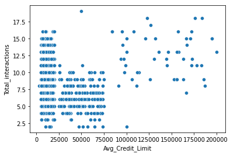

# Retailer Inventory Distribution

Resourced for Feynn Labs by **Bhargav Kantheti**.

---

## Context

Every Multi-National Corporation wants a big chunk of the Indian Market because India is a HUGE growing market opportunity. They generate more revenue from India than any other country except China. The straightforward answer to this is India's *population*. But the main factor is the **localization** of Indian businesses.

Most Indian businesses are localized, mainly focusing on a small region in a city/town. They also employ improper marketing strategies. Since they are local, a customer can often reach out to another retailer. These businesses are very **rigid** and rarely change with current trends. It took a *pandemic* to incentivize these businesses to host an online payment method like Paytm or Google Pay.

MNCs like Amazon have taken advantage of this scattered market and consistently **outsell** local businesses by selling *discounted* products with a **plethora** of options. Their business strategy always keeps changing; they A/B test many features. Even though they might not generate a significant profit, they garner positive net sales compared to the previous year.

---

## Aim

The aim is **not** to **change** how these businesses work. My idea is simple; we need to provide these businesses with viable marketing strategies using Machine Learning. We would provide services to several small-scale businesses and consult them for *free* at the beginning to win their trust. And slowly, as our network grows, the profit for these businesses grows; this will increase our database of customer transactions. Our gross revenue will be from these businesses.

This strategy would let us be a substantially interconnected network that has the agility to adapt to competitors and market fluctuations and mainly, **not** eradicate small businesses that solely operate to be a breadwinner.

---

## Viability

This business model is inspired by how large food chains like Mcdonald's, BurgerKing, Subway, etc., operate. But the main difference
is how our company gets paid by these small businesses for our **services** but not for "brand" value or trade secret recipes. If not,
these foodchains teach us that this technique is highly viable in proving that this technique works.

So let's get into **how** we as a company will be using Machine Learning to assist them.

---

## Goals (Technological)

Enabling technological advancements to enlarge the digital footprint of the business. Since we will want to have customer profiles.

1. Incentivising customers to choose digital payments rather than physical using "smart" discounting.

2. Advocating better accounting techniques using different ML algorithms.

3. Encouraging testing products and reach, which can then be analyzed.

4. Enabling better Inventory management techniques using NLP.

5. Using the invoice generated to stock products, the rate of sales, an item's quantifiable worth, etc., can be calculated and managed.

6. Clustering as to which age group prefers which payment method.

7. This data can then be used to identify which age group buys what.

8. Using previously established items' quantifiable worth, the flexibility of price hike can be deduced, and how often the item is bought could also play a role.

Later, when our business scales up:

9. Correlation between a product from one store to another can be compared across the network.

10. The correlation between each store can be measured, which can be later used to adopt or share services.

---

## Concept

Our main target would be small business owners, who run their businesses offline. Whose primary clientele are locals. We must enable some way of shifting them over to Online Payments. By giving out coupons or discount on next purchase, for paying through digital transaction. If not, a manual accounting can be done \[1\].

Now that we have a database of our customers, we can **Analyse Customer Purchasing Patterns** \[2\]. Using ML models (implementation discussed later) we can classify our customer's purchasing behaviour. **Based** on that, we can decide *what should be discounted, and what not to*. Good sales tactic is to **create** the need. Buy discounting that they would not generally buy, but would definitely buy if we nudge them, can create a reasonable sales bump. This threshold can be calculated from our analysis of Customer Purchases. Another advantage of this customer purchasing pattern database is that we can send mobile notifications when a new product is released and we can decide asto who is more inclined to buy this new product. And also notify for restock of few products that generally sell out quickly on a daily basis, like dairy products.

Using **Target Markets** \[3\], we can decide which type of audience is more inclined to what purchases. Later when our business grows, we can create our own target audience using **Customer Segmentation** \[4\].

**Customer Retention** is very fragile. We must find a threshold asto how often we can make use of our prices. The fluctuation of prices can cause loss in audience. Thus, Customer retention needs to be measured \[5\]. This way, our chain of stores can *hike and discount* prices however we want. Depending on audience and situation. And also utilising how **valuable** some products are. Example: Price increase of Milk and Bread are rarely argued, wherease cost increase in Luxuries might throw off our analyses.

The points discussed till now are necessities, to since engaging customers is our priority. Our main clientele is these small business
owners, to hone them to choosing our network, we must provide few extraneous luxuries. Here are few:

- User Interface like apps, with Computer Vision features with NLP to better catalog their inventory.
- Weekly and Monthly reports of their performance.
- Market research with viability of new grocery products.
- Non Commision based Payment Vendor Partnerships.

---

## Implementation Detail

First and foremost, we have to enable digitisation of the store. Cataloguing items in the store. The final desirable output is shown in Program 1 in the code. Then we would have a profile of each customer.

With this, we can find our favorite customers. And using the time stamp of purchase, we can create a heatmap as follows.

This same technique can be used to create a heat map for a week.

These data can be used to understand customer retention, and popularity of products. We understood 'what' is being bought, lets understand 'how' they are buying these products.

Each customer will have a different capacity to purchase products. We can use credit limit vs product interaction correlation.

We can use this credit limit and apply K-Means clustering to cluster purchases as follows.

Age Group analysis.

Location based clustering.

Purchase Frequency.

The cost of the product, the reliability of the business and the return policies all play an equally important role in deciding the buying behaviour of customers. The cost is an important factor as it was the basic criteria used by online retailers to attract customers. The reliability of the products sold is also important, as it is required in offline retail. It is important because customers need to be sure of the value they gain, especially for new products being endorsed. The logistics factor, which included Cash option, quality of packaging plays a secondary role in this process though these are Must-be-quality. This is so because these all does not interfere with the real product and people believe that this is the basic value they expect.

---

## Dataset and Code

You can find the source of illustrations used above from:
[bharxhav/Retailer-Inventory-Distribution](https://github.com/bharxhav/Retailer-Inventory-Distribution)

Obviously, this is a *novelty* idea, so datasets where not available. But I divided the ML task into 3 main groups as discussed in Implementation. And separate dataset were used for those three. Separate operations, EDA and ML were performed.

---

## Conclusion

This network of retailers might turn out to be the panacea against large MNCs putting small businesses out of business. Slowly, but surely, this retailer inventory distribution system with **smart** business moves influenced by Machine Learning and Data Science might become a new game changer in India.

---

## Attributions

\[1\] [Customer Digital
Transactions](https://www.kaggle.com/datasets/kishlaya18/customer-purchase-journey-netherlands)

\[2\] [Customer Purchasing
Patterns](https://www.kaggle.com/datasets/carrie1/ecommerce-data)

\[3\] [Market Target using
Segmentation](https://www.segmentationstudyguide.com/understanding-market-segmentation/market-segmentation-examples/market-segmentation-example-grocery-shoppers/)

\[4\] [Customer
Segmentation](https://www.kaggle.com/datasets/aryashah2k/credit-card-customer-data)

\[5\] [E-Commerce based Customer
Retention](https://www.kaggle.com/datasets/smokingkrils/ecommerce-platform-analysis-and-prediction)
